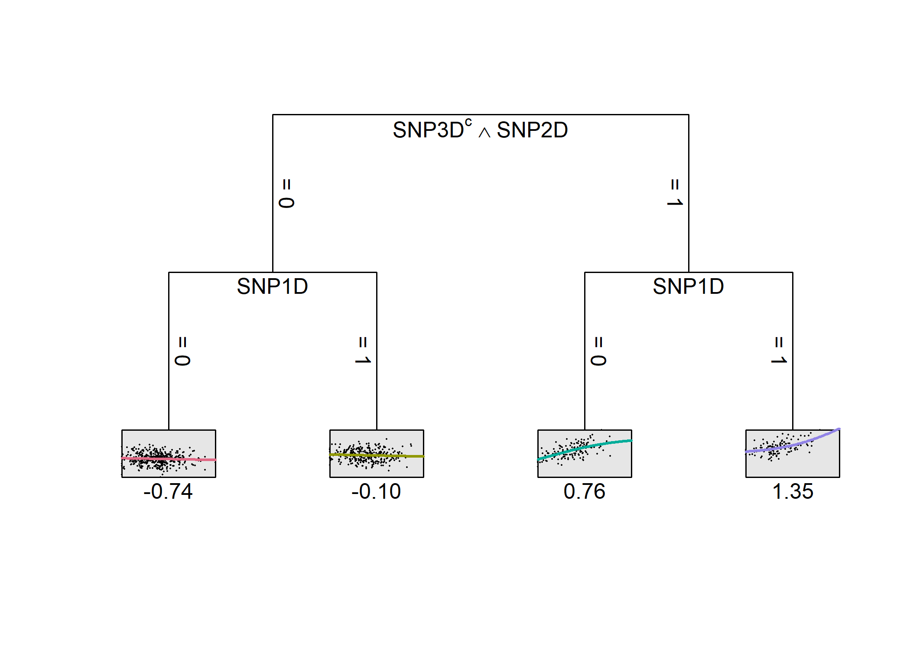
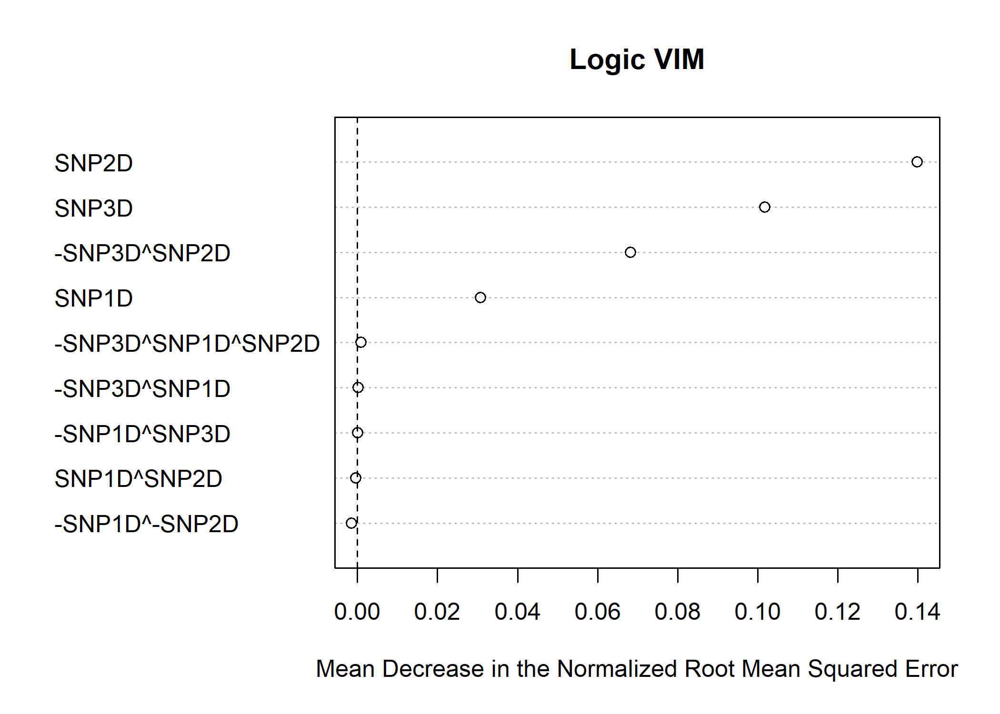

<!-- README.md is generated from README.Rmd. Please edit that file -->

# logicDT

<!-- badges: start -->
<!-- badges: end -->

logicDT (Logic Decision Trees) is a statistical learning procedure for
identifying response-associated interactions between binary predictors.
It is aimed at yielding models with a high predictive power while
maintaining interpretability. The main idea consists of performing a
global search over the set of predictors and Boolean conjunctions of
these and using these terms as input variables of decision trees.

## Installation

You can install the released version of logicDT from
[CRAN](https://CRAN.R-project.org) with:

``` r
install.packages("logicDT")
```

## Example

Here is an example of an epidemiological toy data set consisting of some
SNPs, an environmental covariable and a target disease status.

``` r
library(logicDT)
```

### Data generation

``` r
set.seed(123)
maf <- 0.25 # Minor allele frequency of 25%
n.snps <- 50
N <- 2000 # 2000 samples, the first 1000 for training the remaining 1000 for testing
X <- matrix(sample(0:2, n.snps * N, replace = TRUE,
                   prob = c((1-maf)^2, 1-(1-maf)^2-maf^2, maf^2)), ncol = n.snps)
colnames(X) <- paste("SNP", 1:n.snps, sep="")
X <- splitSNPs(X)
Z <- matrix(rnorm(N, 20, 10), ncol = 1)
colnames(Z) <- "E"
Z[Z < 0] <- 0
# Response generated following a SNP exhibiting a strong marginal effect and
# a more complicated gene-environment interaction
y <- -0.75 + log(2) * (X[,"SNP1D"] != 0) +
  log(4) * Z/20 * (X[,"SNP2D"] != 0 & X[,"SNP3D"] == 0) +
  rnorm(N, 0, 1)
```

### Fitting a single logicDT model

The first half of the data set is used for training and the second half
for testing. The maximum number of variables in the model is set to 3
and the maximum number of terms to 2. Trees shall be fitted until a
minimum node size of 5% of the training data is reached.

``` r
model <- logicDT(X[1:(N/2),], y[1:(N/2)], Z = Z[1:(N/2),,drop=FALSE],
                 max_vars = 3, max_conj = 2,
                 search_algo = "sa",
                 tree_control = tree.control(nodesize = floor(0.05 * nrow(X)/2)),
                 simplify = "vars",
                 allow_conj_removal = FALSE, conjsize = floor(0.05 * nrow(X)/2))
```

### Evaluating the model

Here, the NRMSE (normalized root mean squared error) is used for
evaluting the model on the test data.

``` r
calcNRMSE(predict(model, X[(N/2+1):N,], Z = Z[(N/2+1):N,,drop=FALSE]),
          y[(N/2+1):N])
#> [1] 0.7880122
```

### Visualizing the model

Since a quantitative covariable was included (via 4pL (four parameter
logistic) models), the leaves hold continuous function as can be seen
below.

``` r
plot(model)
```



``` r
print(model)
#> -SNP3D^SNP2D SNP1D
```

### Fitting ensemble models

For maximizing the predictive performance, the ensembling methods
bagging and gradient boosting are implemented as well.

#### Bagging

``` r
model.bagged <- logicDT.bagging(X[1:(N/2),], y[1:(N/2)], Z = Z[1:(N/2),,drop=FALSE],
                                bagging.iter = 50,
                                max_vars = 3, max_conj = 3,
                                search_algo = "greedy",
                                tree_control = tree.control(nodesize = floor(0.05 * nrow(X)/2)),
                                simplify = "vars",
                                conjsize = floor(0.05 * nrow(X)/2))
```

``` r
calcNRMSE(predict(model.bagged, X[(N/2+1):N,], Z = Z[(N/2+1):N,,drop=FALSE]),
          y[(N/2+1):N])
#> [1] 0.7913782
```

#### Gradient boosting

``` r
model.boosted <- logicDT.boosting(X[1:(N/2),], y[1:(N/2)], Z = Z[1:(N/2),,drop=FALSE],
                                  boosting.iter = 50, learning.rate = 0.01,
                                  subsample.frac = 0.75, replace = FALSE,
                                  max_vars = 3, max_conj = 3,
                                  search_algo = "greedy",
                                  tree_control = tree.control(nodesize = floor(0.05 * nrow(X)/2)),
                                  simplify = "vars",
                                  conjsize = floor(0.05 * nrow(X)/2))
```

``` r
calcNRMSE(predict(model.boosted, X[(N/2+1):N,], Z = Z[(N/2+1):N,,drop=FALSE]),
          y[(N/2+1):N])
#> [1] 0.8761629
```

### Variable importance measures (VIMs)

Several VIMs and adjustment techniques for estimating the importances of
interactions are implemented. For estimating VIMs, it is recommended to
use bagged logicDT models, since they usually cover a wider range of
input terms. Plus, no additional data set for an unbiased estimation is
required, since for bagging, the OOB (out of bag) samples can be used.

``` r
vims <- vim(model.bagged)
plot(vims)
```



``` r
print(vims)
#>                  var           vim
#> 1              SNP2D  1.398896e-01
#> 2              SNP3D  1.017960e-01
#> 3       -SNP3D^SNP2D  6.818645e-02
#> 4              SNP1D  3.073858e-02
#> 5 -SNP3D^SNP1D^SNP2D  9.194723e-04
#> 6       -SNP3D^SNP1D  2.430749e-04
#> 7       -SNP1D^SNP3D  9.204539e-05
#> 8        SNP1D^SNP2D -3.565942e-04
#> 9      -SNP1D^-SNP2D -1.431431e-03
```
